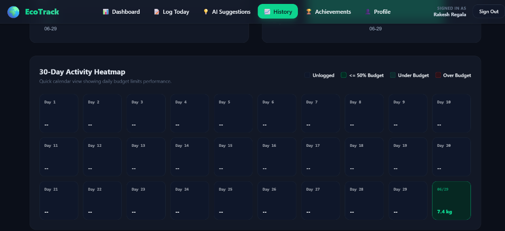
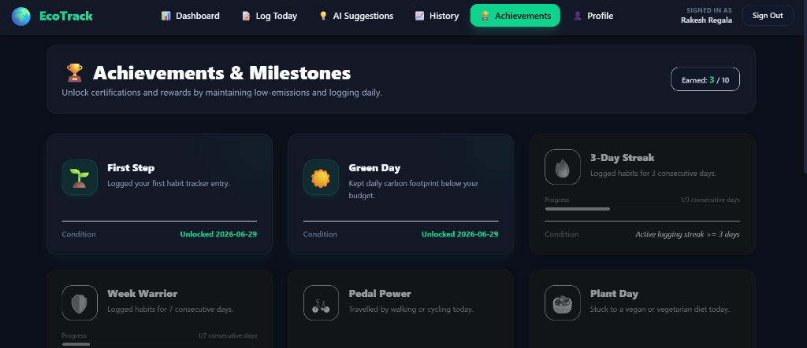

# EcoTrack - Carbon Footprint Tracker Project Documentation
### Carbon Footprint Tracker & AI Lifestyle Swaps Comprehensive System Documentation

---

## Table of Contents
* [Chapter 1: Executive Summary & Detailed Scope](#chapter-1-executive-summary--detailed-scope)
* [Chapter 2: Core Platform Functional Requirements](#chapter-2-core-platform-functional-requirements)
* [Chapter 3: System Use Cases & Core Logging Scenarios](#chapter-3-system-use-cases--core-logging-scenarios)
* [Chapter 4: Architectural Design & Modular Mapping](#chapter-4-architectural-design--modular-mapping)
* [Chapter 5: Architectural Flow & Process Diagrams](#chapter-5-architectural-flow--process-diagrams)
* [Chapter 6: Data Modeling & Firestore Schema Specs](#chapter-6-data-modeling--firestore-schema-specs)
* [Chapter 7: Backend API Specifications & Router Modules](#chapter-7-backend-api-specifications--router-modules)
* [Chapter 8: Emission Coefficients & Calculation Models](#chapter-8-emission-coefficients--calculation-models)
* [Chapter 9: Frontend Architecture & Client Routing](#chapter-9-frontend-architecture--client-routing)
* [Chapter 10: State Management & Auth Context Mechanics](#chapter-10-state-management--auth-context-mechanics)
* [Chapter 11: Daily Habits Logger Interface State Machine](#chapter-11-daily-habits-logger-interface-state-machine)
* [Chapter 12: Gamification Engine & Logging Streaks Math](#chapter-12-gamification-engine--logging-streaks-math)
* [Chapter 13: Achievements Evaluation Matrix & Badges](#chapter-13-achievements-evaluation-matrix--badges)
* [Chapter 14: AI Recommendation Engine & Prompt Optimization](#chapter-14-ai-recommendation-engine--prompt-optimization)
* [Chapter 15: External APIs & Proxy Calculations](#chapter-15-external-apis--proxy-calculations)
* [Chapter 16: Setup Guide & Local Dev Verification](#chapter-16-setup-guide--local-dev-verification)
* [Chapter 17: Platform Testing & Validation Protocols](#chapter-17-platform-testing--validation-protocols)
* [Chapter 18: Non-Functional Specifications & Future Roadmap](#chapter-18-non-functional-specifications--future-roadmap)

---

## Chapter 1: Executive Summary & Detailed Scope

### 1.1 Environmental Motivation
Individual carbon footprint tracking is a crucial starting point for mitigating greenhouse gas accumulation. Daily activities, such as transportation, dietary patterns, and home utility consumption, collectively represent more than 60% of global emissions. However, typical users encounter several barriers in modifying these habits: carbon footprint mathematics is complex, data tracking is tedious, and recommendations are often general rather than context-specific.

EcoTrack represents an integrated solution that eliminates these obstacles. By developing an intuitive, single-page habits logger, connecting it to databases, and leveraging AI models, EcoTrack translates daily decisions into clear scientific values, rewards consistent behavior, and provides personalized suggestions for emissions reduction.

### 1.2 Strategic Platform Scope
EcoTrack is designed as a localized utility platform optimized for rapid evaluation and scaling:
* **Real-Time Inputs Tracking**: Allows users to log and preview carbon emissions metrics on-the-fly, prior to DB persistence.
* **Flexible Persistence Architectures**: Integrates with Firebase Firestore and provides an offline in-memory Demo Mode to support evaluation without cloud services.
* **AI Recommendation Loops**: Generates custom suggestions based on user profiles using the Groq API (LLaMA 3.3).
* **Standard Verification Gateways**: Supports proxy interfaces with third-party emissions datasets like the Carbon Interface API.

---

## Chapter 2: Core Platform Functional Requirements

### 2.1 Core Functions Matrix
The platform supports several primary features configured across the client-server stack:
* **Daily Habits Logger Form**: A multi-step, validated entry wizard that records distances (km), diet choices, food waste flags, electricity usage (kWh), and HVAC details.
* **Dashboard Carbon Gauge Widget**: An visual indicator displaying total emissions logged today relative to the user's budget, with dynamic color grading.
* **AI Swap Generator client**: Connects to the suggestions engine to fetch and render customized lifestyle changes with estimated CO2 offsets.
* **30-Day Historical Data Engine**: Analyzes, computes, and renders long-term statistics (average, best, worst, total) and chart metrics via Chart.js plugins.
* **Profile Settings Controller**: Allows users to toggle budget limits, display names, country locales, and visual themes.
* **Achievements Manager**: Tracks streaks and compares logs history to unlock 10 specific achievement badges.

### 2.2 System Security & Scope Constraints
To ensure robust operations in various environments, the platform maintains strict design rules:
* **Local REST Isolation**: CORS policy restricts access to valid frontend hosts, and client API configurations remain isolated within configuration files.
* **API Key Protection**: Sensitive API keys (Groq, Carbon Interface, Firebase) are loaded only on the server using dotenv variables.
* **Input Character Sanitization**: Validates values (e.g. range checks, float parses) on the backend to prevent injection attempts or memory overflows.

---

## Chapter 3: System Use Cases & Core Logging Scenarios

### 3.1 Daily Logging Flows & Verification
EcoTrack is designed around realistic workflows. The section below describes the primary logging scenarios:

#### Scenario A: Logging Daily Transportation Activities
1. The user navigates to the Logger form. The system defaults to the Travel step.
2. The user inputs their transport mode (e.g. `car_petrol`) and distance traveled (e.g. 35 km).
3. The user specifies passenger count (e.g. 3 for carpooling).
4. The system calculates the carbon footprint for this leg, dividing the baseline emissions by the passenger count.
5. The backend saves the daily log. The dashboard gauge displays the travel footprint fraction and progress against their daily limit.

#### Scenario B: Logging Daily Diet Choices & Food Waste
1. The user proceeds to the Food step in the Logger.
2. The user selects their diet style (meat-heavy, omnivore, vegetarian, vegan).
3. The user enters meal count (representing the proportion of standard meals tracked, e.g. 2 out of 3).
4. The user toggles the food waste flag. If checked, a 10% penalty is added to food emissions.
5. The system saves the document, updating the total daily emissions and reflecting the results on the dashboard.

### 3.2 Advanced Utility Logging & Custom Recommendations Use Cases

#### Scenario C: Logging Home Utility Details
1. The user navigates to the Energy step in the Logger.
2. The user enters electricity consumption in kWh (constrained between 0 and 30 kWh per day).
3. The user toggles checkboxes for active heating or cooling (AC).
4. The system computes emissions using the grid factor, adding flat rates of 2.0 kg for heating and 1.5 kg for AC.
5. The system aggregates all categories and updates the daily total.

#### Scenario D: Fetching AI Lifestyle Swaps
1. The user navigates to the Suggestions tab on the client.
2. The frontend sends today's logged data (totals and category parameters) to the suggestions endpoint.
3. The backend constructs a structured prompt and sends it to the Groq API (LLaMA 3.3).
4. The AI returns three personalized suggestions with estimated CO2 savings.
5. The suggestions are rendered as category-themed cards with visual copy shortcuts.

#### Scenario E: Analytics Dashboard Operations
1. The user opens the History tab.
2. The system fetches the last 30 daily logs chronologically.
3. The client calculates the 7-day average, lowest day, highest day, and monthly total.
4. Chart.js plugins render a 30-day line trend vs budget, a 14-day stacked bar breakdown, and a 30-day activity heatmap.

---

## Chapter 4: Architectural Design & Modular Mapping

### 4.1 Component Architecture Model
EcoTrack is built using a decoupled client-server architecture. This separation ensures that the frontend user interface remains responsive and distinct from backend database and API logic. Communication occurs over HTTP using RESTful JSON payloads.

The project folder structure is organized as follows:
* **`backend/`**: Contains Flask API routes, configurations, virtual environment, and database schemas.
* **`backend/routes/`**: Blueprint modules isolating calculator math, database logging, AI suggestions, and third-party APIs.
* **`frontend/`**: React application built with Vite and styled with Tailwind CSS and custom stylesheets.
* **`frontend/src/components/`**: Reusable UI widgets (GaugeCard, Navbar, BadgeCard, SuggestionCard, Login/Register forms).
* **`frontend/src/pages/`**: Application pages (Dashboard, LogToday, History, Achievements, Profile).
* **`frontend/src/context/`**: Context modules coordinating authentication states, JWT token storage, and themes.
* **`metadata / assets`**: Public folder resources and visual dependencies.

---

## Chapter 5: Architectural Flow & Process Diagrams

### 5.1 Complete Platform Component Map Diagram
The diagram below details the data flow between frontend views, Flask controller blueprints, and database services:

```
+-------------------------------------------------------------+
|                          FRONTEND                           |
|                    (React.js + Tailwind CSS)                |
|  - Auth (Login/Register)        - Dashboard (Gauge, Summary)|
|  - Daily Habit Logger (Travel/Food/Energy)                  |
|  - AI Suggestions Page          - History & Analytics Charts|
|  - Achievements & Streaks       - Settings & Preferences    |
+------------------------------+------------------------------+
                               | API Requests (HTTPS/JSON)
                               v
+-------------------------------------------------------------+
|                          BACKEND                            |
|                       (Flask - Python)                      |
|  - API Layer                 - Business Logic (Calculation)  |
|  - Integration Layer         - Data Access (Firestore Ops)  |
+----+-------------------+----------------+---------------+---+
     |                   |                |               |
     v                   v                v               v
+----------+       +-----------+    +----------+    +----------+
| Firebase |       |   Groq    |    |  Carbon  |    | Firebase |
|   Auth   |       |    API    |    | Interface|    | Firestore|
+----------+       +-----------+    +----------+    +----------+
```

---

## Chapter 6: Data Modeling & Firestore Schema Specs

### 6.1 Firebase Firestore Collections
For authenticated cloud operations, EcoTrack utilizes Firebase Firestore. The database relies on two core collections: 'users' and 'habits'. Below are the JSON schema specifications for each model:

#### The Users Collection (/users/{uid})
This collection stores user profile configurations, streaks, and unlocked achievements. Each document is keyed by the user's Firebase Auth UID.
```json
{
  "uid": "auth_user_uid_hash",
  "displayName": "John Eco Hero",
  "patient_name": "John Eco Hero", // Legacy key alignment
  "budget": 8.0,
  "weekly_goal": 10.0,
  "theme": "dark",
  "country": "in",
  "last_logged_date": "2026-07-05",
  "streak": 3,
  "badges": [
    {
      "id": "first_step",
      "unlocked_at": "2026-07-03"
    },
    {
      "id": "green_day",
      "unlocked_at": "2026-07-04"
    }
  ]
}
```

#### Habits Logging Schema (/habits/{uid}_{date})
Daily logs are saved in the 'habits' collection. Each document represents a single user's logged habits for a specific date. To optimize query performance and ensure direct lookups, the document ID is structured as `{uid}_{date}` (e.g. `user123_2026-07-05`).
```json
{
  "uid": "auth_user_uid_hash",
  "date": "2026-07-05",
  "travel": {
    "mode": "car_petrol",
    "distance": 25.0,
    "passengers": 2
  },
  "food": {
    "diet_type": "vegetarian",
    "meal_count": 3,
    "food_waste": false
  },
  "energy": {
    "electricity_kwh": 8.5,
    "heating": false,
    "ac": true
  },
  "travel_emissions": 2.4,
  "food_emissions": 3.81,
  "energy_emissions": 3.48,
  "total": 9.69,
  "timestamp": "2026-07-05T14:58:29.123Z"
}
```

### 6.2 In-Memory Demo Database Specification
When running in Demo Mode (uid: 'demo_user'), cloud storage is replaced by an in-memory dictionary defined in `firebase_config.py`. The state replicates Firestore operations using basic key lookups, resetting on backend restart.

---

## Chapter 7: Backend API Specifications & Router Modules

### 7.1 API Endpoint Registry
The Flask server exposes endpoints registered using Blueprints. Below is the API specification for carbon calculations:

#### Emissions Calculation Endpoint
Compute carbon footprint values dynamically. This endpoint is stateless and does not write to the database.
* **URL & Method**: `POST /api/calculate/footprint`
* **Headers**: `Content-Type: application/json`

##### Request Body Example
```json
{
  "travel": {"mode": "car_petrol", "distance": 25, "passengers": 2},
  "food": {"diet_type": "vegetarian", "meal_count": 3, "food_waste": false},
  "energy": {"electricity_kwh": 8.5, "heating": false, "ac": true}
}
```

##### Response Body (200 OK)
```json
{
  "success": true,
  "travel_emissions": 2.4,
  "food_emissions": 3.81,
  "energy_emissions": 3.48,
  "total": 9.69,
  "breakdown": {
    "travel": {"mode": "car_petrol", "distance": 25, "passengers": 2},
    "food": {"diet_type": "vegetarian", "meal_count": 3, "food_waste": false},
    "energy": {"electricity_kwh": 8.5, "heating": false, "ac": true}
  }
}
```

### 7.2 Habits Persistence & Achievements Endpoints

#### Log Habits Endpoint
Compute and save today's carbon footprint log. Updates the user's logging streak.
* **URL & Method**: `POST /api/habits/log`
* **Auth Required**: `Bearer JWT Token` (or `'demo_token'`)

##### Response Body (200 OK)
```json
{
  "success": true,
  "date": "2026-07-05",
  "total": 9.69,
  "streak": 3,
  "travel_emissions": 2.4,
  "food_emissions": 3.81,
  "energy_emissions": 3.48
}
```

#### Get Today's Log Endpoint
* **URL & Method**: `GET /api/habits/today` (Optional query param: `?date=YYYY-MM-DD`)
* **Response (200 OK)**: `{"success": true, "log": { ... }}` or `{"success": false}`

#### Get History Endpoint
* **URL & Method**: `GET /api/habits/history`
* **Response (200 OK)**: `{"success": true, "history": [ {log_1}, {log_2}, ... ]}`

#### Badges Management Endpoints
* `GET /api/habits/badges`: Fetches the list of unlocked badges.
* `POST /api/habits/badges`: Saves an updated badges list: `{"badges": [ {id, unlocked_at} ]}`.

### 7.3 User Configuration & Middlewares

#### Manage Settings Endpoint
Retrieve or update user configurations (e.g. daily carbon budget, displayName, theme, locale country, weekly goal).
* **URL & Method**: `GET /api/habits/settings` | `PATCH /api/habits/settings`
* **Request Payload (PATCH)**: `{"budget": 7.5, "displayName": "Eco Champion"}`
* **Response (200 OK)**: `{"success": true, "settings": { ... }}`

### 7.4 Middleware Interceptor Authorization Code Walkthrough
To intercept requests, evaluate token validity, and populate client context, backend controllers use a `require_auth` decorator. Below is the implementation structure:
```python
def require_auth(f):
    @wraps(f)
    def decorated(*args, **kwargs):
        auth_header = request.headers.get('Authorization')
        if not auth_header or not auth_header.startswith('Bearer '):
            return jsonify({'error': 'Unauthorized'}), 401
        token = auth_header.split(' ')[1]
        if token == 'demo_token':
            request.uid = 'demo_user'
            return f(*args, **kwargs)
        try:
            decoded_token = auth.verify_id_token(token)
            request.uid = decoded_token['uid']
            request.user = decoded_token
        except Exception:
            return jsonify({'error': 'Invalid token'}), 401
        return f(*args, **kwargs)
    return decorated
```

---

## Chapter 8: Emission Coefficients & Calculation Models

### 8.1 Scientific Coefficient Matrix
Emissions are calculated using standard scientific factors representing kilograms of carbon dioxide equivalent (kg CO2e) per unit. These coefficients are configured on the backend:

#### Transportation Mode Coefficients (kg CO2 / km / person)
| Transport Mode | API Key ID | Factor | Passenger Scale |
| :--- | :--- | :--- | :--- |
| Car (Petrol) | `car_petrol` | 0.192 | Scaled: Divided by passengers |
| Car (Diesel) | `car_diesel` | 0.171 | Scaled: Divided by passengers |
| Car (Electric) | `car_electric` | 0.053 | Scaled: Divided by passengers |
| Bus | `bus` | 0.089 | Shared: Divided by passengers |
| Train | `train` | 0.041 | Fixed (No passenger scaling) |
| Motorcycle | `motorcycle` | 0.114 | Scaled: Divided by passengers |
| Bicycle / Walk | `bicycle` / `walking` | 0.000 | Zero Emissions |

#### Diet Baseline Coefficients (kg CO2 / day)
| Diet Type | ID Key | Emissions Factor | Food Waste Penalty |
| :--- | :--- | :--- | :--- |
| Meat-Heavy Diet | `meat-heavy` | 7.19 kg CO2e / day | +10% of total diet emissions |
| Omnivore Diet | `omnivore` | 5.63 kg CO2e / day | +10% of total diet emissions |
| Vegetarian Diet | `vegetarian` | 3.81 kg CO2e / day | +10% of total diet emissions |
| Vegan Diet | `vegan` | 2.89 kg CO2e / day | +10% of total diet emissions |

#### Energy Consumption Factors
* **India Power Grid Factor**: 0.233 kg CO2 per kWh of electricity consumed.
* **HVAC Flat Rates**: Active Heating adds 2.0 kg; Active Air Conditioning (AC) adds 1.5 kg.

---

## Chapter 9: Frontend Architecture & Client Routing

### 9.1 React SPA Structure
The client frontend is developed as a Single Page Application (SPA) using React. Vite compiles the assets and processes fast-refresh changes during development. The frontend coordinates page routing, user session state context, layout styling, and charts configuration.

### 9.2 Private and Public Routing Rules
To protect screens, the client implements route guards. Private routes require an active user session; otherwise, they redirect to `/login`. Public routes (e.g. login/register) redirect authenticated users to `/`.

```javascript
// Private Route Wrapper (from App.jsx)
function PrivateRoute({ children }) {
  const { currentUser } = useAuth();
  return currentUser ? children : <Navigate to="/login" replace />;
}

// Public Route Wrapper (from App.jsx)
function PublicRoute({ children }) {
  const { currentUser } = useAuth();
  return !currentUser ? children : <Navigate to="/" replace />;
}
```

---

## Chapter 10: State Management & Auth Context Mechanics

### 10.1 Authentication & Theme Context Flow
The `AuthContext` wrapper provides global states for authentication and user settings. It handles login, registration, logout, user profile hydration, and active color theme states.

#### User Profile Hydration & Initial Load Flow
1. On app mount or user change, AuthContext fetches the user's settings profile using the auth token.
2. If settings exist, it sets displayName, budget, country, and theme states.
3. If settings do not exist, it initializes default settings (budget=8.0, theme='dark') on the backend.

#### Demo Mode Authentication Bypass
To support evaluations without database credentials, the frontend includes a 'Try Demo Mode' action. This sets a mock user context and uses a static auth token ('demo_token') in API requests.
```javascript
async function getAuthToken() {
  if (isDemoMode) {
    return 'demo_token';
  }
  if (!auth.currentUser) return null;
  return await auth.currentUser.getIdToken(true);
}
```

---

## Chapter 11: Daily Habits Logger Interface State Machine

### 11.1 Logger Form Wizard Configuration
The logger interface (`LogToday.jsx`) is configured as a multi-step form wizard to simplify data entry for the user. Each step represents a distinct category:
* **Step 1: Travel Form**: Captures transport mode, distance, and passenger count.
* **Step 2: Food Form**: Captures diet type, meal count, and food waste checkbox.
* **Step 3: Energy Form**: Captures electricity in kWh and heating/cooling toggles.

### 11.2 State Transition Diagram
Transitions are managed using a numeric state variable (`step`). The form validates current inputs before transitioning. If validation succeeds, `step` increments; if it fails, the system displays an error banner at the top of the card.

### 11.3 Real-Time Preview Calculations
To show the user their emissions impact immediately, the client uses a `useEffect` hook to calculate emissions previews in real-time as the form inputs change.
```javascript
useEffect(() => {
  const travelEst = (travel.distance * TRANS_COEF[travel.mode]) / travel.passengers;
  const foodEst = FOOD_COEF[food.diet_type] * (food.meal_count / 3.0) * (food.food_waste ? 1.1 : 1.0);
  const energyEst = energy.electricity_kwh * ELEC_FACTOR + (energy.heating ? 2.0 : 0) + (energy.ac ? 1.5 : 0);
  setPreviews({ travel: travelEst, food: foodEst, energy: energyEst, total: travelEst + foodEst + energyEst });
}, [travel, food, energy]);
```

---

## Chapter 12: Gamification Engine & Logging Streaks Math

### 12.1 Logging Streak Mathematics
To calculate streaks, the backend compares the user's current logging date with the last logged date stored in their profile document. This logic is handled inside `update_user_streak` in `habits.py`:
```python
try:
    log_date = datetime.strptime(log_date_str, '%Y-%m-%d').date()
except ValueError:
    return 0

last_logged_str = user_data.get('last_logged_date')
current_streak = user_data.get('streak', 0)

if not last_logged_str:
    new_streak = 1
else:
    try:
        last_logged = datetime.strptime(last_logged_str, '%Y-%m-%d').date()
        diff = (log_date - last_logged).days
        if diff == 1:
            new_streak = current_streak + 1
        elif diff == 0:
            new_streak = current_streak if current_streak > 0 else 1
        else:
            new_streak = 1
    except Exception:
        new_streak = 1
```

### 12.2 Timezone & UTC Alignment Guidelines
Because users may log from different timezones, dates are normalized to YYYY-MM-DD format using UTC ISO dates on the client. This ensures that calculations remain consistent regardless of the client's local timezone offset.



---

## Chapter 13: Achievements Evaluation Matrix & Badges

### 13.1 Badges Matrix & Logical Criteria
The achievements matrix details the 10 badges evaluated in `badges.js` after each daily habit submission:

| ID | Badge Title | Condition Check Formula | Database Verification |
| :--- | :--- | :--- | :--- |
| `first_step` | First Step | `totalLogs >= 1` | Verifies overall logs count in history |
| `green_day` | Green Day | `totalEmissions <= budget` | Verifies day's emissions is under budget |
| `streak_3` | 3-Day Streak | `streak >= 3` | Evaluates current active logging streak |
| `week_warrior` | Week Warrior | `streak >= 7` | Evaluates current active logging streak |
| `pedal_power` | Pedal Power | `mode in [walk, cycle]` | Verifies travel distance is > 0 km |
| `plant_day` | Plant Day | `diet in [vegan, veg]` | Checks daily food diet type selections |
| `low_energy` | Low Energy | `energy_emissions <= 1.0` | Checks daily home utility carbon load |
| `monthly_hero` | Monthly Hero | `totalLogs >= 15` | Checks total logs count in database |
| `monthly_master` | Monthly Master | `totalLogs >= 30` | Checks total logs count in database |
| `zero_waster` | Zero Waster | `food_waste == false` | Verifies food waste checkbox was unchecked |

### 13.2 Achievements Evaluation Process
The client evaluates achievements by passing the updated log, user history, and existing badges to `evaluateBadges`. If new badges are unlocked, they are appended to the user profile document and displayed in a modal container before redirecting to the dashboard.

---

## Chapter 14: AI Recommendation Engine & Prompt Optimization

### 14.1 Groq LLaMA 3.3 Prompt Engineering
To retrieve personalized recommendations, the suggestions route passes a structured prompt to Groq's LLaMA 3.3 model. The system instructs the LLM to output a raw JSON array containing three specific suggestion objects with title, description, category, and saving fields:
```json
Here is the daily carbon footprint breakdown of the user:
- Daily Carbon Budget: 8.0 kg CO2
- Total Footprint Today: 12.5 kg CO2
- Travel: 4.8 kg CO2 (Mode: car_petrol, Distance: 25 km, Passengers: 1)
- Food: 5.63 kg CO2 (Diet: omnivore, Meals: 3, Food Waste: true)
- Energy: 2.07 kg CO2 (Electricity: 9.0 kWh, AC: true)

Generate exactly 3 personalized, practical eco swaps in a raw JSON array format:
[
  {
    "title": "Carpool or Walk",
    "description": "Sharing rides for your 25km trip saves emissions.",
    "category": "travel",
    "estimated_co2_saving": 2.4
  }
]
```

### 14.2 Robust JSON Extraction Parser
To handle parsing anomalies (such as markdown tags or text preamble returned by the AI), the backend implements `extract_json`. This function strips code blocks, locates the outermost brackets, and parses the raw JSON payload.



---

## Chapter 15: External APIs & Proxy Calculations

### 15.1 Carbon Interface API Client
For external footprint evaluations, the backend implements proxy endpoints to interface with the Carbon Interface API. These endpoints manage the authorization headers and payloads required by the third-party service.

### 15.2 Electricity Estimation Model
The electricity estimation endpoint passes values, units, and regional ISO codes to Carbon Interface. If the API is unconfigured, it falls back to regional coefficients defined statically on the server.

### 15.3 Flight Distance & Haversine Mathematical Model
To calculate flight distances when the API key is not present, the server uses the Haversine formula to compute great-circle distances between airport coordinates. It then scales emissions based on short-haul or long-haul coefficients and passenger counts.
```python
def haversine_distance(coord1, coord2):
    R = 6371.0 # Earth radius in km
    lat1, lon1 = map(math.radians, coord1)
    lat2, lon2 = map(math.radians, coord2)
    dlat = lat2 - lat1
    dlon = lon2 - lon1
    a = math.sin(dlat/2)**2 + math.cos(lat1)*math.cos(lat2)*math.sin(dlon/2)**2
    c = 2 * math.atan2(math.sqrt(a), math.sqrt(1-a))
    return R * c
```

---

## Chapter 16: Setup Guide & Local Dev Verification

### 16.1 Installation Prerequisites
Ensure the local system has Python 3.8+ and Node.js 16+ installed before configuring the project dependencies.

### 16.2 Backend Installation Steps
```bash
cd backend
python -m venv venv
source venv/bin/activate  # On Windows: venv\Scripts\activate
pip install -r requirements.txt
python app.py
```

### 16.3 Frontend Installation Steps
```bash
cd frontend
npm install
npm run dev
```

### 16.4 Environment Variables Setup
Create configuration files in both root folders to define API credentials:
* **backend/.env**: Define `GROQ_API_KEY` and `CARBON_INTERFACE_API_KEY`.
* **frontend/.env**: Define Firebase credentials matching your Firestore client config.

### 16.5 Exposing Public Tunnels via Ngrok
To expose local ports for external testing, deploy them using secure Ngrok tunnels:
```bash
ngrok http 5000 --domain=your-backend.ngrok-free.app
ngrok http 5173 --domain=your-frontend.ngrok-free.app
```

---

## Chapter 17: Platform Testing & Validation Protocols

### 17.1 Verification Plan Checklist
The verification checklist below outlines the manual test scenarios used to validate platform behavior:
* **Demo Mode Logging Access**: Click 'Try Demo Mode' on the login page. Verify redirection to `/` and budget hydration.
* **Real-Time Preview Validation**: Open `/logger`. Change distance to 20 km. Verify total estimates update dynamically.
* **Validation Constraints**: Enter 35 kWh in the energy usage field. Confirm that save fails with a 400 validation error.
* **Badges Unlock Workflow**: Complete log with vegetarian diet and no food waste. Verify Green Day and Zero Waster badges modal displays.
* **AI Recommendation Generation**: Open `/suggestions`. Confirm loading skeleton component displays, followed by three suggestions.
* **Historical Charts Loading**: Open `/history`. Verify Chart.js renders line trend vs budget, breakdown charts, and heatmap calendar.
* **Carbon Calculators Testing**: Open `/profile`. Enter 20 kWh in utility estimator. Confirm emission results update correctly.
* **Cross-Browser Responsive Layout**: Toggle viewport to Mobile (375px) in DevTools. Confirm Navbar collapses and tables wrap.

---

## Chapter 18: Non-Functional Specifications & Future Roadmap

### 18.1 Non-Functional Specifications
To support production environments, the system satisfies key non-functional criteria:
* **Performance Targets**: Aggregated database queries complete in under 200ms, and cached configurations load instantly.
* **Security Parameters**: All API keys are restricted to the server, and CORS policies block requests from unauthorized domains.
* **Visual Design & Theme system**: Glassmorphism layouts use consistent colors and follow responsive layout grids.

### 18.2 Future Enhancements Roadmap
Planned improvements for future iterations of the EcoTrack platform include:
* **Regional Grid Integrations**: Connect directly to local grid operators to fetch live utility emission factors based on real-time grid status.
* **Aviation IATA Database Integration**: Integrate flight route logger forms with full international IATA database auto-complete libraries.
* **Receipt OCR Scanning Module**: Implement image recognition scanners to parse food and utility invoices directly.
* **Community Achievements Leaderboard**: Enable friends to compare carbon budgets, track streaks, and share custom achievement badges.
